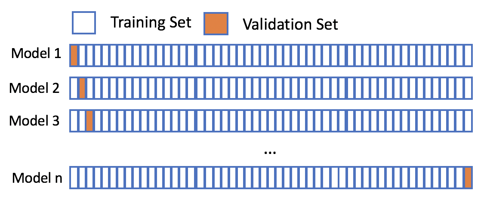

```{r setup, include=FALSE}
knitr::opts_chunk$set(echo = TRUE)
```


### By Anika John, Liliane Trafelet & Thibault Schowing

Same dataset as Exercise 18

Prostate-specific antigen (PSA) is an enzyme whose level is used as a (controversial) indicator of prostate cancer; however, a high level may also indicate other prostate diseases. The Prostate data set examines the correlation between PSA levels and other clinical measures in men who were about to receive a radical prostatectomy. 

The dataset contains these variables:

| Name | Content |
|----------------------------------------|-------------------------------------------------|
| lcavol  | log(cancer volume) |
| lweight  | log(prostate weight) |
| age  | age |
| lbph  | log(benign prostatic hyperplasia amount) |
| svi  | seminal vesicle invasion |
| lcp  | log(capsular penetration) |
| gleason  | Gleason score |
| pgg45 percentage Gleason scores 4 or 5 | percentage Gleason scores 4 or 5 |
| lpsa  | log(prostate specific antigen); response variable  |

The data set is included in the R package lasso2 and can be loaded as follows:


```{r}
data(Prostate, package = "lasso2")

```


#### *a) RECALL: Fit a linear model to the data set using LASSO regression. Use the function cv.glmnet from the R package glmnet as in exercise 18.a).*

Here we use the cross validation to find the best lambda.

___

```{r}
library(glmnet)
X <- as.matrix(Prostate[,-ncol(Prostate)])
set.seed(1234)
prostate.lasso.cv <- cv.glmnet(X, Prostate$lpsa)
plot(prostate.lasso.cv)
```


* *As in exercise 18 we get that the optimal $\lambda$ is the biggest lambda within one standard deviation of the smallest MSE. We can get it with:* 

```{r}
lambda <- prostate.lasso.cv$lambda.1se; lambda
```

  And the coefficients are:

```{r}
coef(prostate.lasso.cv)
```

___


* *Determine the "optimal" regularization parameter in advance.* 

We run the model again but this time specifying the $\lambda$ in directly in glmnet (**We do not need the cross validation to find lambda here**): 


```{r}
prostate.lasso2 <- glmnet(X, Prostate$lpsa, lambda=lambda)
coef(prostate.lasso2)
```


___

* *Estimate the generalization performance measured by the mean squared error (MSE) for this value of $\lambda$ "by hand" (i.e., writing an own R function, not relying on the estimates from cv.glmnet). Do you get the same values as cv.glmnet?*

___

This pseudo-code is on page 168 of the slides:

1. Given: response vector $Y$ ($n$ measurements), design or model matrix $X$
2. For each data point $i = 1,...,n$, do:
    a. Remove data point $i$ from $Y$ and $X$
    b. Fit a linear model on the remaining $n-1$ data points using regularized regression
    c. predict the value of $Y_i$ based on the fitted coefficients, using explanatory variables $x_{i1}, ..., x_{ip}$; denote the estimated value by $\hat{Y_i}$
3. Calculate the *mean squared error*

##### In short: 
Use every variable as a validation set for the model fitted with the others and calculate the MSE.




___

```{r}
# Define the matrixes
X <- as.matrix(Prostate[,-ncol(Prostate)])
Y <- Prostate$lpsa

# Leave one out cross validation for a fixes lambda

leave_one_out_CV <- function(lambda){
  n <- nrow(X)
  p <- ncol(X) # Just FYI
  
  errors <- numeric(n) # Numerical vector of size n, one for each "left out" variable 
  
  for (i in 1:n){
    # Create a temporary matrix/response vector without the ith row
    tmpX <- X[-i,]
    tmpY <- Y[-i]
    
    
    # We do the same prediction as above with a fixed lambda with n-1 observation
    prostate.lasso <- glmnet(tmpX, tmpY, lambda = lambda)
    
    # Then we predict the value with the fitted model for the missing observation i
    prediction <- predict(prostate.lasso, newx = X[i, , drop=FALSE], s=lambda, type="link")
      #type: Type of prediction required. Type "link" gives the linear predictors for "binomial" or "multinomial" models
      #drop=FALSE: trick to avoid automatic conversion in vector or other datastructure of 1D data when we need a dataframe or a matrix
    
    # Calculate the error (difference between predicted and real value for i) and store it
    errors[i] <- prediction - Y[i]
  }
  # Calculate and return the mean squared error
  return(mean(errors**2))
}

# We then do the cross validation with the built-in function with a fixed lambda
# We do a k-fold cross validation with 'nrow'  folds which is similar than doing a LOOCV
# ?cv.glmnet -> parameter lambda has to be a sequence

rloocv <- cv.glmnet(X,Y, lambda = c(10, 0.19), nfolds = nrow(Prostate), grouped=F)


```

With our function we get a mean squared error of: 

```{r}
leave_one_out_CV(0.19)
```

And with the built-in function we get one value for each lambda. *cvm: The mean cross-validated error - a vector of length length(lambda).*


```{r}
rloocv$cvm
```

Result: The two MSE are the same (woohoo !).


___

#### b) *Fit a linear model performing forward selection, using the function stepAIC from the MASS package. Estimate the MSE also for the model you get from stepAIC. How does it perform compared to the LASSO estimate?*


```{r}
library(MASS)
#Start with the null model / no explanatory variable
prostate.empty <- lm(Prostate$lpsa ~ 1, data = Prostate)
# ... and the full one / all explanatory variable
prostate.full <- lm(Prostate$lpsa ~ ., data = Prostate)
# Perform the forward selection
prostate.fw <- stepAIC(prostate.empty, scop=as.formula(prostate.full), direction = "forward", trace = 0)

summary(prostate.fw)


```

The forward selection returned a model containing the variables *lcavol*, *lweight*, *svi*, *lbph* and *age*.


We do a cross validation again to have a MSE (mean squared error)

```{r}
# Define the matrixes
#X <- as.matrix(Prostate[,-ncol(Prostate)])
Y <- Prostate$lpsa

n <- nrow(Prostate)
error <- numeric(n)

for(i in 1:n){
  # Subset is directly available in the lm() function 
  tmp.fw <- lm(formula(prostate.fw), data = Prostate, subset = -i)
  prediction <- predict(tmp.fw, newdata=data.frame(Prostate[i,]))
  error[i] <- prediction - Y[i]
}

print(mean(error^2))

```

___
##### Results
___

* Mean Squared Error with LASSO: __0.6159392__
  + Predictors *lcavol*, *lweight* and *svi*
  
* Mean Squared Error with forward selection: __0.5430164__
  + Predictors *lcavol*, *lweight*, *svi*, *lbph* and *age*.

The forward selection method seems to work a little bit better than the LASSO but the model is more complex. 
___


#### c) 


- Drop = FALSE trick:
http://www.win-vector.com/blog/2018/02/r-tip-use-drop-false-with-data-frames/

- Predict function from a glmnet object:
https://www.rdocumentation.org/packages/glmnet/versions/1.1-1/topics/predict.glmnet


