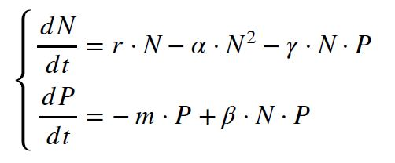

```{r setup, include=FALSE}
knitr::opts_chunk$set(echo = TRUE)
```


## Thibault Schowing (13-870-365)

## Classical models in biology (exercises) BL.6003

# Lotka-Volterra model


```{r, echo=FALSE}
# Do not display warning messages (for arrows of length 0)
defaultW <- getOption("warn") 
options(warn = -1) 
```


```{r}
library(deSolve)
library(ggplot2)
library(tidyr)
#?ode
```

## 1. Phase space and vector field of the Lotka-Volterra model

As for the SI model in series 2, draw the phase space, the non-trivial zero growth isoclines, and the vector field of the Lotka-Volterra. Use the following sets of parameters and initial conditions:

$r = 1$, $\gamma = 2$, $\beta = 1$ and $m = 1 $

$(N(0), P(0)) = (0.2,0.2), (1,0.5), (0.1,0)$ and $(0,2) $


```{r}
# Parameters
# Exercise 3: beta
p <- list(r = 1, gamma = 2, beta = 1, m = 1)

# Derivative
f <- function(t,N,p){
  Np <- N[1]
  P <- N[2]
  dN <- p$r * Np - p$gamma * Np * P
  dP <- p$beta * Np * P - p$m * P
  return(list(c(dN,dP)))
}

time_steps <- seq(0,50,0.05)

# Initial states
N0 <- c(0.2,0.2)
N1 <- c(1,0.5)
N2 <- c(0.1,0)
N3 <- c(0,2)

# Model solutions
out0 <- ode(y = N0, times = time_steps, func = f, parms = p, method = c("ode45"))
out1 <- ode(y = N1, times = time_steps, func = f, parms = p, method = c("ode45"))
out2 <- ode(y = N2, times = time_steps, func = f, parms = p, method = c("ode45"))
out3 <- ode(y = N3, times = time_steps, func = f, parms = p, method = c("ode45"))


# Sequences for the vector field
N0.g <- seq(0,15,1)#S
N1.g <- seq(0,10,1)#I

# Empty plot
plot(NA, xlab = "Prey (N)", ylab="Predator (P)", xlim=c(0,15), ylim=c(0,10), 
     main = "Phase Space and vector field")

# Draw each arrow
for (i in 1:length(N0.g)){
  for (j in 1:length(N1.g)){
    N <- N0.g[i]
    P <- N1.g[j]
    dN <- p$r * N - p$gamma * N * P
    dP <- -p$m * P + p$beta * N * P
    arrows(N, P, N+dN/7, P+dP/7, length = 0.02, col = "darkgreen")
  }
}

# Trajectories and start point
lines(x = out0[,2], y = out0[,3], col='blue', lwd = 2)
points(N0[1],N0[2],pch=19,cex=1,col='blue')

lines(x = out1[,2], y = out1[,3], col='red', lwd = 2)
points(N1[1],N1[2],pch=19,cex=1,col='red')

lines(x = out2[,2], y = out2[,3], col='chocolate', lwd = 2)
points(N2[1],N2[2],pch=19,cex=1,col='chocolate')

lines(x = out3[,2], y = out3[,3], col='chartreuse1', lwd = 2)
points(N3[1],N3[2],pch=19,cex=1,col='chartreuse1')

legend(12,10,legend=c("N0: 0.2,0.2", "N0: 1,0.5", "N0: 0.1,0", "N0: 0,2"), 
       col=c("blue", "red", "chocolate", "chartreuse1"), lty=1, cex=0.8, bg = "white")

abline(v = p$m/p$beta, col='black', lwd = 2)

abline(h = p$r/p$gamma, col='black', lwd = 2)

```


The non-trivial zero-growth isoclines are shown in black. 


## 2. Lotka-Volterra model with a logistic growth for the prey
Here we will study a first modification of the original Lotka-Volterra model. Instead of assuming an exponential growth for the prey, we will assume a logistic growth. This new model is then given by:




As previously, you will have to draw the phase space, the non-trivial zero growth isoclines, and the vector field of this new model. Use the following sets of parameters and initial conditions:


$r = 1$, $\gamma = 2$, $\beta = 1$, $m = 1$ and $\alpha = 1/3$ 

$(N(0), P(0)) = (0.2,0.2), (1,0.5), (0.1,0)$ and $(0,2)$


```{r}
# Parameters
# Exercise 3: beta
p <- list(r = 1, gamma = 2, beta = 1, m = 1, alpha = 1/3)

# Derivative
f <- function(t,N,p){
  Np <- N[1]
  P <- N[2]
  dN <- p$r * Np - p$alpha * Np**2 - p$gamma * Np * P
  dP <- p$beta * Np * P - p$m * P
  return(list(c(dN,dP)))
}

time_steps <- seq(0,50,0.05)

# Initial states
N0 <- c(0.2,0.2)
N1 <- c(1,0.5)
N2 <- c(0.1,0)
N3 <- c(0,2)

# Model solutions
out0 <- ode(y = N0, times = time_steps, func = f, parms = p, method = c("ode45"))
out1 <- ode(y = N1, times = time_steps, func = f, parms = p, method = c("ode45"))
out2 <- ode(y = N2, times = time_steps, func = f, parms = p, method = c("ode45"))
out3 <- ode(y = N3, times = time_steps, func = f, parms = p, method = c("ode45"))


# Sequences for the vector field
N0.g <- seq(0,5,0.2)#S
N1.g <- seq(0,8,0.2)#I

# Empty plot
plot(NA, xlab = "Prey (N)", ylab="Predator (P)", xlim=c(0,3), ylim=c(0,4), 
     main = "Phase Space and vector field")

# Draw each arrow
for (i in 1:length(N0.g)){
  for (j in 1:length(N1.g)){
    N <- N0.g[i]
    P <- N1.g[j]
    dN <- p$r * N - p$alpha * N**2 - p$gamma * N * P
    dP <- p$beta * N * P - p$m * P
    arrows(N, P, N+dN/7, P+dP/7, length = 0.02, col = "darkgreen")
  }
}

# Trajectories and start point
lines(x = out0[,2], y = out0[,3], col='blue', lwd = 2)
points(N0[1],N0[2],pch=19,cex=1,col='blue')

lines(x = out1[,2], y = out1[,3], col='red', lwd = 2)
points(N1[1],N1[2],pch=19,cex=1,col='red')

lines(x = out2[,2], y = out2[,3], col='chocolate', lwd = 2)
points(N2[1],N2[2],pch=19,cex=1,col='chocolate')

lines(x = out3[,2], y = out3[,3], col='chartreuse1', lwd = 2)
points(N3[1],N3[2],pch=19,cex=1,col='chartreuse1')

# Zero growth isoclines for the predator
abline(v = p$m/p$beta, col='black', lwd = 2)


# Zero growth isocline for the prey
x <- seq(0,4,0.1)
y <- p$r/p$gamma - p$alpha / p$gamma * x
lines(x,y, col='black', lwd = 2)


legend(2,4,legend=c("N0: 0.2,0.2", "N0: 1,0.5", "N0: 0.1,0", "N0: 0,2"), 
       col=c("blue", "red", "chocolate", "chartreuse1"), lty=1, cex=0.8, bg = "white")

```

The non-trivial zero-growth isoclines are shown in black. 


```{r, echo=FALSE}
options(warn = defaultW)
```


