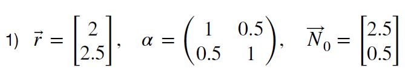
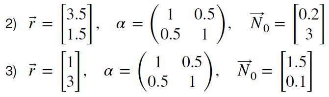
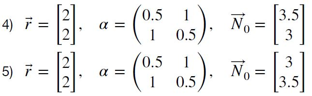

```{r setup, include=FALSE}
knitr::opts_chunk$set(echo = TRUE)
```


## Thibault Schowing (13-870-365)

## Classical models in biology (exercises) BL.6003

# Series 4: Lotka-Volterra model for competition


```{r, echo=FALSE}
# Do not display warning messages (for arrows of length 0)
defaultW <- getOption("warn") 
options(warn = -1) 
```


```{r}
library(deSolve)
library(ggplot2)
library(tidyr)
#?ode
```

## 1. 

In this series, we will study the classical Lotka-Volterra model for competition between two species. The abundances of the two species are given by $N_1$ and $N_2$ . The model is given by the following set of differential equation. Note that in the code, for more readability, the two species are called P for predator and N for prey. 


The parameters of the model are $r_i > 0$ the intrinsic growth rates $\alpha_{ij} > 0$ and the competition strength of species $j$ on species $i$ coefficients.

For the following five sets of parameters, draw the phase space, the non-trivial zero growth isoclines, and the vector field. You will have to determine the equations for the non-trivial zero growth isoclines (hint: they are lines).


```{r}
# Parameters
# Exercise 4


# One function to plot them all and in the pdf to display them. 
# Parameters: 
#   - p: list of parameters for ODE
#   - out: result of ODE
#   - N0: initial state
#   - color: color

vector_field <- function(p, out, N_init, color){
  
  # Limit for the graphical area
  limit = 5
  
  # Sequences for the vector field
  N0.g <- seq(0,limit,0.3)#S
  N1.g <- seq(0,limit,0.3)#I
  
  # Empty plot
  plot(NA, 
       xlab = "N1", # Prey 
       ylab = "N2", # Predator 
       xlim = c(0,limit), 
       ylim = c(0,limit),
       main = "Phase Space and vector field")
  
  # Draw each arrow
  for (i in 1:length(N0.g)){
    for (j in 1:length(N1.g)){
      N1 <- N0.g[i]
      N2 <- N1.g[j]
      dN1 <- N1 * (p$r[1] - p$alpha[1] * N1 - p$alpha[2] * N2) # 
      dN2 <- N2 * (p$r[2] - p$alpha[3] * N1 - p$alpha[4] * N2) # 
      arrows(N1, N2, N1+dN1/15, N2+dN2/15, length = 0.03, col = "darkgreen", lwd = 1)
    }
  }
  
  # Isoclines
  
  #non-trivial zero growth isocline for N1
  isocline_1_intercept <- p$r[1]/p$alpha[2]
  Isocline_1_slope <- -(p$alpha[1])/p$alpha[2]
  
  #non-trivial zero growth isocline for N2
  isocline_2_intercept <- p$r[2]/p$alpha[4]
  isocline_2_slope <- -(p$alpha[3])/p$alpha[4]
  
  
  abline(a=isocline_1_intercept, b= Isocline_1_slope, col='cornflowerblue', lty='dotted', lwd = 2)
  abline(a=isocline_2_intercept, b= isocline_2_slope, col='deeppink2', lty='dotted', lwd = 2)
    
  # Trajectories and start point
  lines(x = out[,2], y = out[,3], col=color, lwd = 2)
  points(N_init[1],N_init[2],pch=19,cex=1,col=color)
}

# Derivative
f <- function(t,N,p){
  N1 <- N[1]
  N2 <- N[2]
  dN1 <- N1 * (p$r[1] - (p$alpha[1] * N1) - (p$alpha[2] * N2))
  dN2 <- N2 * (p$r[2] - (p$alpha[3] * N1) - (p$alpha[4] * N2))
  return(list(c(dN1,dN2)))
}

time_steps <- seq(0,250,0.05)

# Initial states
N0 <- c(2.5,0.5)
N1 <- c(0.2,3)
N2 <- c(1.5,0.1)
N3 <- c(3.5,3)
N4 <- c(3,3.5)

Nx <- c(3,3)

# Parameters
p0 <- list(r = c(2,2.5), alpha = c(1,0.5,0.5,1))
p1 <- list(r = c(3.5,1.5), alpha = c(1,0.5,0.5,1))
p2 <- list(r = c(1,3), alpha = c(1,0.5,0.5,1))
p3 <- list(r = c(2,2), alpha = c(0.5,1,1,0.5))
p4 <- list(r = c(2,2), alpha = c(0.5,1,1,0.5))

px <- list(r = c(2,2), alpha = c(0.5,1,1,0.5))


# Model solutions

out0 <- ode(y = N0, times = time_steps, func = f, parms = p0, method = c("ode45"))
out1 <- ode(y = N1, times = time_steps, func = f, parms = p1, method = c("ode45"))
out2 <- ode(y = N2, times = time_steps, func = f, parms = p2, method = c("ode45"))
out3 <- ode(y = N3, times = time_steps, func = f, parms = p3, method = c("ode45"))
out4 <- ode(y = N4, times = time_steps, func = f, parms = p4, method = c("ode45"))

outx <- ode(y = Nx, times = time_steps, func = f, parms = px, method = c("ode45"))
# Plots bellow 


```


# Results

Explain the differences that you can see between these five sets of parameters and initial condition. In particular, how can we understand the difference between the set 1) and the sets 4) and 5)? What happens with sets 2) and 3) ?

## Set 1


```{r}
vector_field(p0,out0,N0,"blue")
```


## Set 2 and 3



```{r}
vector_field(p1,out1,N1,"red")
# N1 is a better competitor
```


```{r}
vector_field(p2,out2,N2,"chocolate")
# N2 is a better competitor
```


## Set 4 and 5


```{r}
vector_field(p3,out3,N3,"Brown")

```


```{r}
vector_field(p4,out4,N4,"firebrick")
```

In both cases 4 and 5 we have an unstable coexistence where interspecific competition is more importante than intraspecific competition.
In case 4, N1 starts with an advantage in number, situation reverted in case 5. We can also see that al the parameters are symetrical (growth rate and competition strength).

We can try to reach the unstable equilibrium point by giving the two species the same advantage in the beginning:


```{r}
vector_field(px,outx,Nx,"cyan")
```


 As we can see, the equilibrium point is indeed unstable, deSolve's ode45 solver is not tricked by our parameters. 


```{r, echo=FALSE}
options(warn = defaultW)
```


